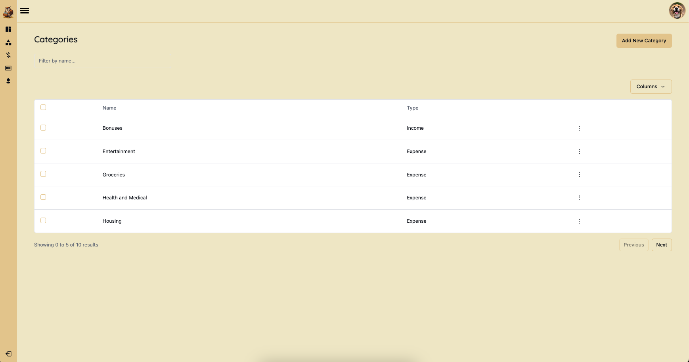
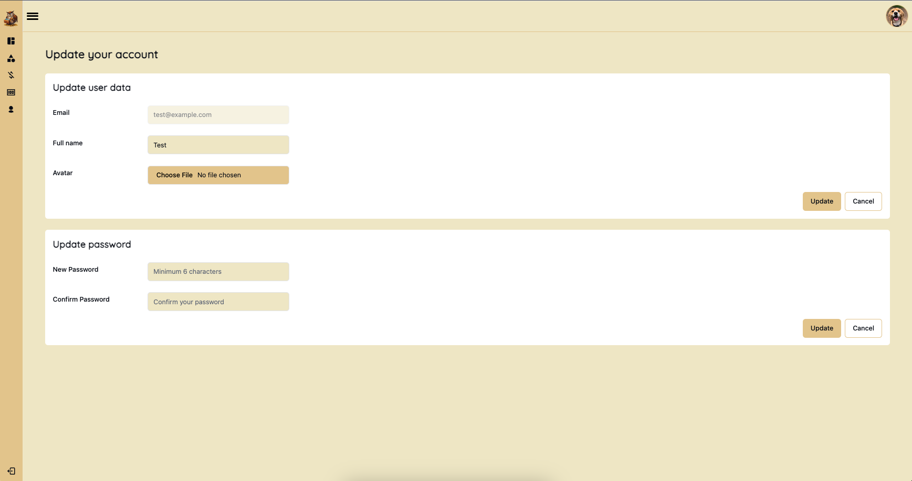
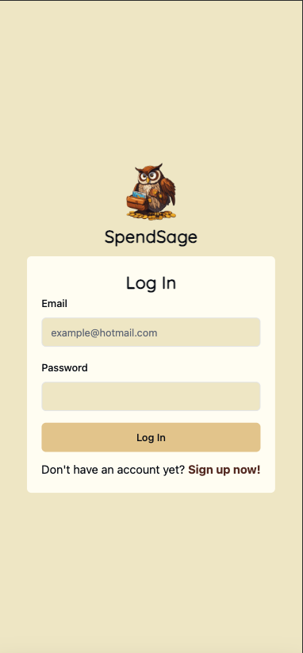
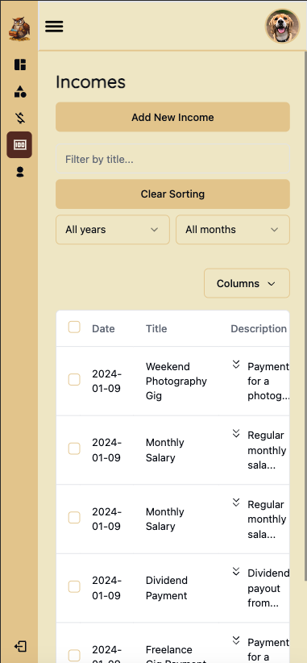

# Spend Sage

## Description

Spend Sage is a modern web application designed to help users manage their finances efficiently. With intuitive features for tracking expenses, recording incomes, and analyzing spending patterns, Spend Sage empowers users to make informed financial decisions. The platform offers customizable categories, insightful visualizations, and user-friendly interfaces, making it easy for individuals to gain control over their finances. Whether tracking daily expenses, monitoring income sources, or setting budget goals, Spend Sage provides the tools users need to achieve financial wellness and stability.

## Technologies Used

### Frontend:

- React: A JavaScript library for building user interfaces.
- React Router: A library for declarative routing in React applications.
- Tailwind CSS: A utility-first CSS framework for quickly building custom designs.
- Shadcn: A component library builder that leverages Tailwind CSS, enabling the creation of custom UI components with Tailwind's utility-first approach.
- Echarts: A powerful charting and visualization library.
- Recharts: A composable charting library built on top of React components.
- Lucide React: A library of open-source SVG icons for React.
- React Hook Form: A library for flexible and efficient form validation and management in React.
- React Day Picker: A flexible date picker component for React.
- React Hot Toast: A notifications library for React applications.
- Spinners React: A collection of loading spinner components for React.
- Tailwind Hamburgers: A library of hamburger menu animations for Tailwind CSS.

### State Management:

- Redux Toolkit: A package that provides utilities for Redux, including simplified setup, efficient data fetching, and standardized reducers and actions.
- RTK Query: A data fetching and caching toolkit built on top of Redux Toolkit, designed to simplify fetching, caching, and updating data in React applications.

### Backend and Data Management:

- Supabase: A cloud-based platform that provides authentication, real-time database, and other services for building modern applications.

### Development Tools:

- Vite: A fast, modern build tool for frontend development.
- TypeScript: A typed superset of JavaScript that compiles to plain JavaScript.
- ESLint: A tool for identifying and reporting patterns in JavaScript code.

### Additional Libraries and Utilities:

- JWT Decode: A library for decoding JSON Web Tokens (JWT) in JavaScript.
- Zod: A TypeScript-first schema declaration and validation library.

## Screenshots

### Desktop







### Mobile







## Demos
https://github.com/Zurisaday01/spend-sage/assets/65831005/5b6f22c7-180c-416f-99f1-2b5b8706ea9f
https://github.com/Zurisaday01/spend-sage/assets/65831005/4bc7a146-f6b3-4c8d-a2ee-095306cd9971

## Project Structure

Source Code Directory

```markdown
└── 📁src
    └── App.tsx
    └── 📁components
        └── 📁ui
            └── button.tsx
            └── calendar.tsx
            └── checkbox.tsx
            └── dialog.tsx
            └── dropdown-menu.tsx
            └── form.tsx
            └── input.tsx
            └── label.tsx
            └── popover.tsx
            └── select.tsx
            └── table.tsx
            └── tabs.tsx
            └── textarea.tsx
    └── 📁features
        └── 📁auth
            └── LoginForm.tsx
            └── SignUpForm.tsx
            └── UpdatePasswordForm.tsx
            └── UpdateUserDataForm.tsx
            └── authSlice.ts
        └── 📁categories
            └── CategoriesColumns.tsx
            └── CategoriesTable.tsx
            └── CreateCategoryForm.tsx
            └── DeleteCategoryBtn.tsx
            └── UpdateCategoryForm.tsx
        └── 📁expenses
            └── CreateExpenseForm.tsx
            └── DeleteExpenseBtn.tsx
            └── ExpensesColumns.tsx
            └── ExpensesTable.tsx
            └── UpdateExpenseForm.tsx
        └── 📁incomes
            └── CreateIncomeForm.tsx
            └── DeleteIncomeBtn.tsx
            └── IncomesColumns.tsx
            └── IncomesTable.tsx
            └── UpdateIncomeForm.tsx
    └── index.css
    └── main.tsx
    └── 📁pages
        └── Account.tsx
        └── Categories.tsx
        └── Dashboard.tsx
        └── Expenses.tsx
        └── Incomes.tsx
        └── Login.tsx
        └── PageNotFound.tsx
        └── SignUp.tsx
    └── 📁services
        └── apiAuth.ts
        └── apiCategories.ts
        └── apiTransactions.ts
        └── baseApi.ts
        └── supabase.ts
    └── store.ts
    └── types.ts
    └── 📁ui
        └── AppLayout.tsx
        └── CategoriesCard.tsx
        └── CategoriesTabs.tsx
        └── FilterByOptions.tsx
        └── HamburgerBtn.tsx
        └── Header.tsx
        └── HeaderFuntionality.tsx
        └── Logo.tsx
        └── LogoutBtn.tsx
        └── MiniSpinner.tsx
        └── NavItem.tsx
        └── Navigation.tsx
        └── Pagination.tsx
        └── PeriodGraph.tsx
        └── ProtectedRoute.tsx
        └── SearchBar.tsx
        └── Sidebar.tsx
        └── Spinner.tsx
        └── TransactionCard.tsx
        └── TransactionDoughnutCard.tsx
        └── TransactionOptions.tsx
        └── UserAvatar.tsx
    └── 📁utils
        └── index.ts
    └── vite-env.d.ts
```

## Types of Visualizations Used in the Dashboard

1. **Total Expenses:**
   This visualization provides a clear overview of the user's total expenses over a specified period.

2. **Total Incomes:**
   This visualization provides a clear overview of the user's total incomes over a specified period.

3. **Amount Spent by Expense Categories:**
   This visualization categorizes expenses into distinct categories (such as groceries, transportation, utilities, etc.) and showcases the amount spent in each category. By visualizing expenditure distribution, users can identify spending patterns, prioritize budget allocations, and adjust their financial habits as needed.

4. **Amount Spent by Income Categories:**
   Similar to expense categories, this visualization categorizes incomes into specific categories (e.g., salary, freelance earnings, investments) and displays the amount earned from each category. Users can gain insights into their income sources, track income diversity, and evaluate their financial stability over time.

5. **Transactions from Filtered Month and Year:**
   This visualization allows users to filter transactions by month and year, with the default setting being the current month. It displays spending on the Y-axis over time on the X-axis, enabling users to track and analyze their financial activities for specific periods. This functionality facilitates informed decision-making and promotes financial awareness.

## Tables

1. **Categories Table:**

   - The Categories table stores the categories created by the user for organizing expenses and incomes.
   - Each category has a name and a type (expense or income) to categorize transactions effectively.
   - Users can customize categories based on their financial activities, such as groceries, housing, entertainment, etc.
   - Pagination: The table supports pagination, allowing users to navigate through large lists of categories efficiently.

2. **Expenses Table:**

   - The Expenses table records the expenses incurred by the user, categorized under specific categories.
   - Users can track their spending habits across different expense categories over time.
   - Pagination: Users can paginate through the list of expenses for easier navigation.
   - Filtering: Expenses can be filtered by year and month, enabling users to view expenses for specific time periods.

3. **Incomes Table:**
   - The Incomes table logs the incomes earned by the user, associated with specific income categories.
   - Users can monitor their sources of income and track their earnings across different income categories.
   - Pagination: Users can paginate through the list of incomes for easier navigation.
   - Filtering: Incomes can be filtered by year and month, enabling users to view incomes for specific time periods.

## Account Functionalities

1. **Add and Update Avatar:**

   - Users have the option to personalize their accounts by adding an avatar picture.

2. **Update User Data:**

   - Users can update their account information (full name and avatar).

3. **Update Password:**
   - Users have the ability to update their account passwords for security purposes.

## Code Samples implementing RTK Query

To maintain a clean and organized structure, I inject endpoints for different API operations into the base API.

### Base Api Configuration

The following code snippet configures the base API for RTK Query, including setting up the base URL, authentication headers, and tag types.

```typescript
// Base Api
export const baseApi = createApi({
	reducerPath: 'api',
	baseQuery: fetchBaseQuery({
		baseUrl: supabaseUrl,
		credentials: 'include',
		prepareHeaders: (headers, { getState }) => {
			const token = (getState() as RootState).auth.token;

			if (token) headers.set('authorization', `Bearer ${token}`);

			return headers;
		},
	}),
	tagTypes: ['Categories', 'Transactions', 'User'],
	endpoints: () => ({}),
});
```

### Categories Api

The code snippet sets up the categories API using RTK Query. It defines endpoints for fetching, creating, updating, and deleting categories.

```typescript
export const apiCategories = baseApi.injectEndpoints({
	endpoints: builder => ({
		getCategories: builder.query<QueryResultCategories, GetCategoriesParams>(
			{}
		),
		getCategory: builder.query({}),
		createCategory: builder.mutation({}),
		updateCategory: builder.mutation({}),
		deleteCategory: builder.mutation({}),
	}),
});

export const {
	useGetCategoriesQuery,
	useGetCategoryQuery,
	useCreateCategoryMutation,
	useUpdateCategoryMutation,
	useDeleteCategoryMutation,
} = apiCategories;
```

## Testing accounts
1. **Email:**  
   test01@example.com  
   **Password:**  
   test20

2. **Email:**  
   test02@example.com  
   **Password:**  
   test20
   
